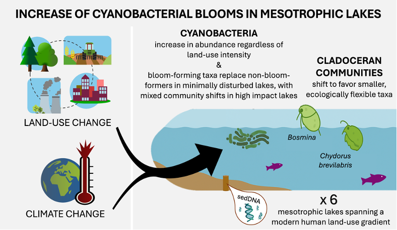

# Long-term trends in aquatic communities of mesotrophic lakes along a land-use gradient in eastern Canada

Scripts associated with the article

---

King L, MacKeigan PW, Garner RE, Aucoin ME, Beisner BE, Domaizon I, Smol JP, Gregory-Eaves I. Long-term trends in aquatic communities of mesotrophic lakes along a land-use gradient in eastern Canada. *Anthropocene* **53**, 100507. https://doi.org/10.1016/j.ancene.2025.100507.

 ---

## scripts/

- **01-dada2.R** Initiate DADA2 pipeline on DNA reads (previously trimmed in Cutadapt): learn error rates, dereplicate reads, infer ASVs, merge paired-end reads, and construct sequence table.
- **02-dada2_bimeras.R** In DADA2, remove chimeric ASVs.
- **03-dada2_taxonomy.R** In DADA2, assign ASV taxonomy.
- **04-dada2_readtracking.R** Track sequence loss through the DADA2 pipeline.
- **05-format_asvs.R** Format ASVs by assigning unique ASV codes, joining sequence and taxonomy information, and parsing sample names.
- **06-curate_asvs.R** Curate ASVs by removing global singletons and doubletons and retaining taxa of interest (class Cyanobacteriia).
- **07-site_by_genus.R** Format site by genus matrix for ASVs assigned to Cyanobacteriia.
